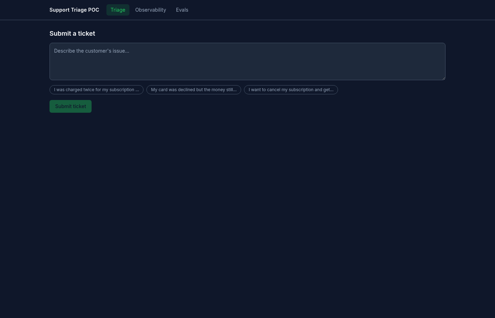
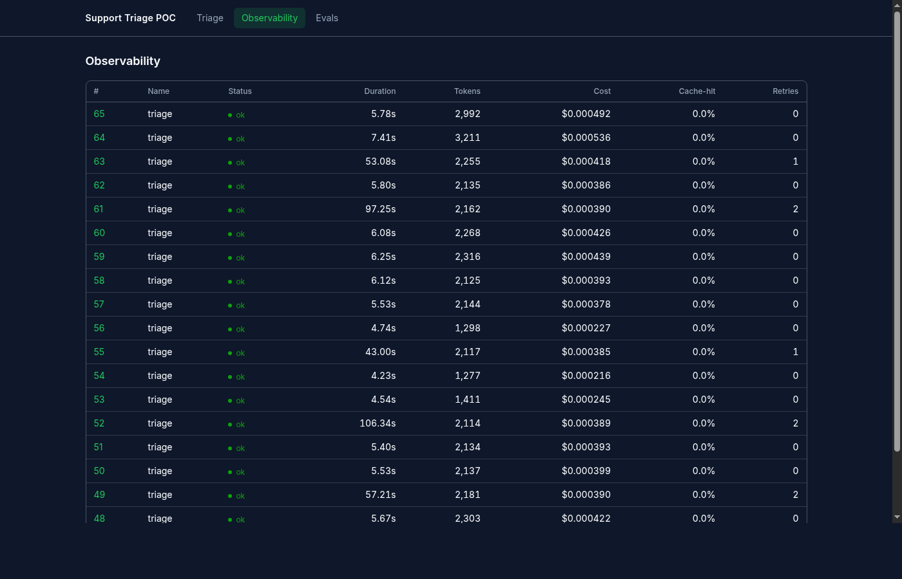
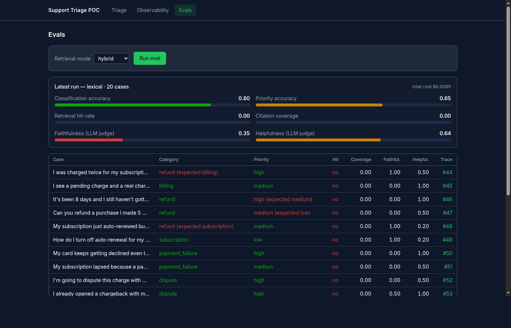

# Multi-Agent Support Triage POC

A **framework-free** multi-agent system that triages **Stripe payments support tickets** —
refunds, disputes, failed charges, subscription billing — and drafts cited resolutions **grounded
in real Stripe documentation**. Built to demonstrate a checklist of AI-engineering concepts:
orchestration without a framework, MCP, Skills, RAG with lexical+semantic search in
Postgres/pgvector, tool use, the LLM API, retry/backoff, prompt caching, observability
(spans/traces/cost), evals (golden set + LLM-as-judge), and a React UI that makes the whole
pipeline legible.

**Status: 9/9 phases done.** See [`tasks/todo.md`](tasks/todo.md) for the phase-by-phase build
log with verification notes, and [`tasks/HANDOFF.md`](tasks/HANDOFF.md) for a from-scratch
session handoff.

- **Specs** (source of truth): [`specs/`](specs/) — read `specs/00-overview.md` first.
- **Concept → code map** (for reviewers): [`docs/CONCEPTS.md`](docs/CONCEPTS.md).
- **Repo map** — every backend folder is one concept (details in [`backend/app/README.md`](backend/app/README.md)):
  ```
  backend/app/
  ├── agents/         orchestration (framework-free) · subagent context · parallelism
  ├── tools/          function-calling registry (+ the tool-use loop in agents/loop.py)
  ├── mcp/            MCP server + client
  ├── rag/            RAG · lexical+semantic search in pgvector · embeddings · seed data
  ├── skills/         SKILL.md loader + definitions/ (progressive disclosure)
  ├── llm/            provider abstraction · retry/backoff · prompt caching
  ├── evals/          golden set + LLM-as-judge
  ├── observability.py  spans / traces / cost
  ├── api/            thin HTTP routers
  └── main.py config.py db.py schema.sql   entrypoint + plumbing
  ```
- **Demo talking track**: [`docs/DEMO_SCRIPT.md`](docs/DEMO_SCRIPT.md).
- **Stack**: FastAPI (Python 3.12) · React + Vite + Tailwind · Postgres 16 + pgvector · TEI
  embeddings · LLM behind a provider interface (**Gemini free tier** now, **Claude** later — one
  env var swap).

## Domain

This is **not** a generic chatbot — it's scoped to one domain, with a knowledge base to match:

| Source | Content | Count |
|---|---|---|
| Real Stripe docs (`docs.stripe.com`) | Refunds, disputes, subscription cancellation, 3D Secure | 4 pages |
| Wikipedia | Chargebacks, 3D Secure, credit card fraud, PCI DSS | 4 pages |
| Synthetic KB articles | Help-center-style payments policy/procedure articles | 8 articles |
| Synthetic past tickets | Resolved tickets used as retrieval precedent | 15 tickets |

Fetched, chunked, and embedded into the same Postgres/pgvector store the agent retrieves from —
see `backend/app/seed_data.py` (synthetic content) and `backend/app/rag/ingest.py` (`FETCH_URLS`,
the real Stripe/Wikipedia pages). Ticket categories the classifier recognizes:
`billing · refund · subscription · payment_failure · dispute · other`.

## Screenshots

| Triage — live agent timeline | Observability — span waterfall | Evals — scores + judge reasoning |
|---|---|---|
|  |  |  |

## Running the app

### 1. Prerequisites
- Docker + Docker Compose installed and running.
- A free **Gemini API key** — https://aistudio.google.com → *Get API key* (no credit card
  required). The stack won't serve LLM-backed endpoints without one.

### 2. Configure environment
```bash
cp .env.example .env
```
Open `.env` and paste your key into `GEMINI_API_KEY=`. Everything else in `.env.example` already
has working defaults — leave `LLM_PROVIDER=gemini` and the `MODEL_*`/infra vars as they are unless
you're swapping providers (see `specs/03-claude-integration.md`).

### 3. Start all services
```bash
docker compose up -d --build
```
This builds and starts five containers: `db` (Postgres+pgvector), `embeddings` (TEI), `mcp`,
`backend` (FastAPI), `frontend` (Vite dev server). `--build` is only needed the first time or
after a dependency change — plain `docker compose up -d` is enough for a normal restart.

### 4. Wait for everything to come up healthy
```bash
curl localhost:8000/health          # {"status":"ok","db":true,"tei":true,...}
```
On first boot, `embeddings` downloads the `bge-small-en-v1.5` model (~130 MB), so `tei` may
report `false` for a minute or two — poll `/health` until it flips to `true` before continuing.

### 5. Build the knowledge base (one-time)
```bash
curl -X POST 'localhost:8000/ingest?fetch=true&reset=true'
```
Fetches Stripe docs + Wikipedia payment topics, chunks, embeds, and stores them (~77s, no LLM
calls involved). This only needs to run once — the data persists in the `pgdata` Docker volume
across restarts, so you don't need to re-run it every time you `docker compose up`.
> Ingest fetches KB pages over plain HTTP. English Stripe content requires a US egress (VPN) —
> from a non-US IP, Stripe's site geo-localizes to another language. Only matters if you reset
> and re-fetch; the already-ingested KB is unaffected.

### 6. Open the app
```bash
open http://localhost:5173
```
Three screens: **Triage** (submit a ticket, watch it resolve live), **Observability** (trace list
+ span waterfall), **Evals** (golden-set scores). See the demo path below, or the full talking
track in [`docs/DEMO_SCRIPT.md`](docs/DEMO_SCRIPT.md).

### Stopping / restarting
```bash
docker compose down          # stops containers, keeps the pgdata volume (KB survives)
docker compose down -v       # also wipes the volume — you'll need to re-run step 5
docker compose logs backend --since 5m   # tail logs for one service
docker compose restart backend           # after editing backend/ imports or app lifespan code
```
The backend hot-reloads plain code edits inside `app/` automatically (bind mount + `--reload`);
a manual restart is only needed after import/lifespan-level changes, and a rebuild
(`docker compose build backend`) only after a `pyproject.toml` dependency change.

**Demo path**: open the Triage screen, submit *"I was charged twice for my subscription this
month, please refund the duplicate."*, watch the live agent timeline (classify → retrieve in
parallel → resolve → critique), then check the same run's trace on the Observability screen and
the golden-set scores on the Evals screen. Full walkthrough: [`docs/DEMO_SCRIPT.md`](docs/DEMO_SCRIPT.md).

## Architecture
```
React (Vite)  ──HTTP/SSE──▶  FastAPI  ──▶  Agent layer (pure Python, no framework)
  Triage (live SSE timeline)   /ingest        orchestrator: classify∥plan → retrieve×N (parallel)
  Observability (waterfall)    /agent/triage              → resolve → critique → (1 revision)
  Evals report                 /agent/triage/stream (SSE)
                                /traces, /traces/{id}       tools: hybrid_search / get_document /
                                /evals, /evals/run                 get_ticket / escalate
                                                                    (also exposed via MCP server)
                                                                          │
                                            Postgres 16 + pgvector
                                   documents · chunks · traces · spans · eval_runs · eval_cases
```

Ingest pipeline: **HTTP fetch + markdownify (url→md) → RecursiveCharacterTextSplitter (md→chunks)
→ TEI (chunk→vector) → Postgres (embedding + tsvector)**.

## Services & ports
| Service | URL | Purpose |
|---|---|---|
| backend | http://localhost:8000 | FastAPI + agent layer |
| frontend | http://localhost:5173 | React UI (Triage / Observability / Evals) |
| embeddings (TEI) | http://localhost:8080 | bge-small-en-v1.5 (384-dim) |
| db | localhost:5433 | Postgres 16 + pgvector (host 5433 to avoid a local Postgres on 5432) |
| mcp | http://localhost:9000/mcp | MCP server exposing search tools |

## API endpoints
| Endpoint | What |
|---|---|
| `GET /health` | db + TEI reachability |
| `POST /ingest?fetch=&reset=` | build the knowledge base |
| `GET /search?q=&mode=lexical\|semantic\|hybrid&k=` | raw search, any mode |
| `POST /llm/chat` `/llm/stream` `/llm/retry-demo` `/llm/cache-demo` `/llm/classify-demo` | LLM-provider building blocks (Phase 2) |
| `POST /agent/answer` | single tool-using agent |
| `POST /agent/answer-mcp` | same, tools sourced over MCP |
| `POST /agent/triage?skill=&search_mode=` | the full multi-agent pipeline, synchronous |
| `POST /agent/triage/stream?skill=&search_mode=` | same pipeline, **live SSE** — one `step_start`/`step_done` event per phase, then `final` |
| `GET /traces` `/traces/{id}` | list runs / full span tree — tokens, cost, cache-hit %, retries |
| `POST /evals/run?retrieval_mode=` `GET /evals` | golden-set eval run (20 cases) + latest results |

## Notable design decisions
- **No agent framework** — a hand-rolled orchestrator + provider SDK only (`google-genai` now,
  `anthropic` later). See `specs/04-agents.md`.
- **LLM provider abstraction** — Gemini free tier today (`LLM_PROVIDER=gemini`, all roles on
  `gemini-flash-lite-latest`, the only free-tier model with workable quota); Claude is a one env
  var swap once billing unblocks (`app/llm/base.py` is provider-neutral). See `specs/03-claude-integration.md`.
- **Real SSE streaming, not simulated** — `/agent/triage/stream` emits genuine per-step events
  from concurrently-running subagents (via an `asyncio.Queue` fan-in), so the live timeline
  reflects actual wall-clock overlap, not a client-side animation. See `specs/08-frontend.md`.
- **Postgres + pgvector only** — lexical (`tsvector`) and semantic (`vector`) search fused with
  Reciprocal Rank Fusion, no separate vector database. See `specs/02-rag.md`.

## Known limitations (by design, for a POC)
- Gemini free-tier quota (15 req/min, daily caps) makes a full 20-case eval run take **~11
  minutes** — the UI surfaces this, it isn't a hang. See `specs/07-evals.md`.
- Prompt-cache metrics report 0% on the free tier (caching isn't available there); the interface
  and dashboard are ready for Claude, where it will populate.
- Re-fetching the Stripe docs needs a US egress (VPN) or you'll ingest a non-English localization
  of the same pages; the seeded knowledge base already persists in the `pgdata` volume, so this
  only matters if you reset and re-fetch.
